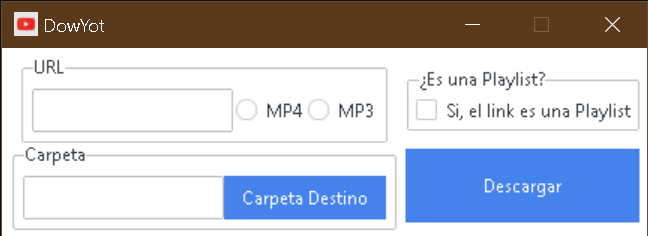

### Aplicación para descargar Vídeos de YouTube en Vídeo o Solo Audio

## Instalación

1. Descargue o clone este repositorio
2. Ejecute INSTALL.bat para instalar python y las dependencias necesarias o descarge Python y ejecute en terminal
"pip install pipenv" seguido de "pipenv install" desde el repositorio clonado
3. Ya puede usar DowYot.bat para descargar videos o playlist de youtube en mp3 o mp4
