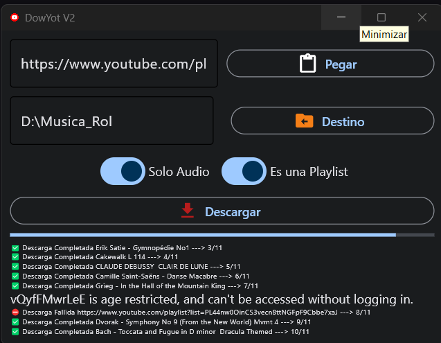

# Aplicación para descargar Vídeos de YouTube en Vídeo o Solo Audio

## Instalación en Windows

1. Descargue o clone este repositorio
2. Ejecute INSTALL.bat para instalar python y las dependencias necesarias o descarge Python
(<https://www.python.org/ftp/python/3.12.2/python-3.12.2-amd64.exe>) y ejecute en terminal
"pip install pytube"
3. Ya puede usar DowYot.bat para descargar videos o playlist de youtube en mp3 o mp4
